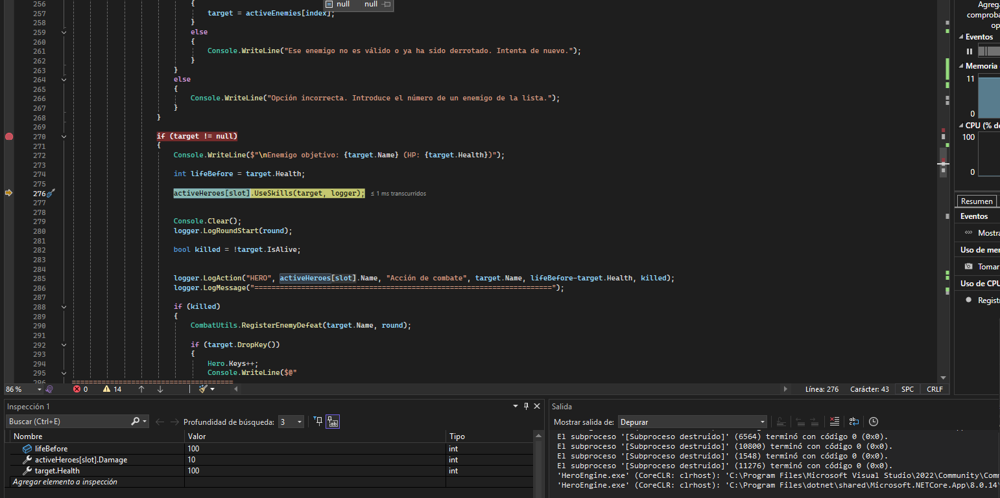
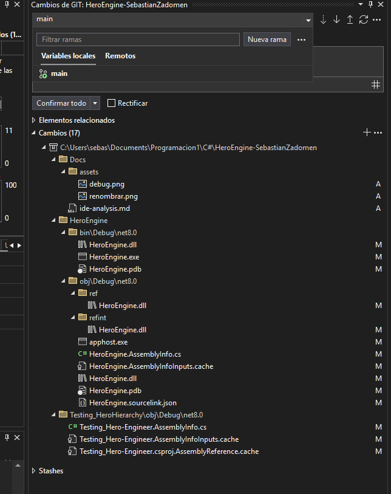
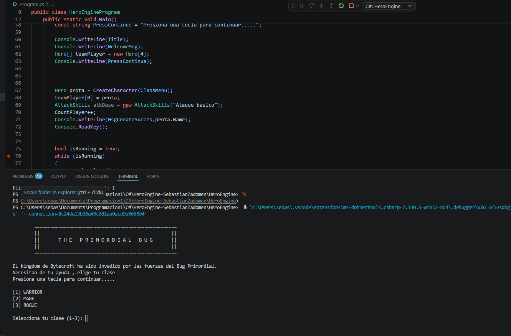

## Análisis Técnico: Visual Studio Community 2022

Este es el IDE principal utilizado durante el desarrollo de **HeroEngine**. 

### 1. Edición de código y Refactoring
La experiencia inicial de escritura es excelente gracias a la integración de **IntelliCode** (IA). El sistema es capaz de predecir las intenciones de lo que quieres programar y autocompletar bloques de código enteros, acertando de manera casi exacta en lo que estas escribiendo. 
* **Navegación:** Muy intuitiva; permite saltar entre clases y métodos fácilmente.
* **Documentación:** El IDE te deja acudir facilmente a la api de Microsft dejandote resolver tus dudas.
* **Refactoring:** Una herramientas que uso mucho es la de renombrar variables o extraer métodos, esto da una faciliadad a la hora de refactorizar codigo.

> 

### 2. Depurador (Debugger)
Es uno de los puntos más fuertes a mi parecer. Permite una inspección profunda en tiempo de ejecución :
* **Puntos de ruptura (Breakpoints):** Se colocan faciles al igual que su gestion .
* **Inspección en tiempo real:** Se pueden ver los valores exactos de las variables (como la vida de los héroes o el daño de las habilidades) simplemente pasando el ratón por encima del código mientras el programa está pausado, lo cual es de gran ayuda.

> 

### 3. Generación de ejecutables y NuGet
La gestión de dependencias es muy visual y didáctica. Mediante el gestor de paquetes **NuGet**, instalar o actualizar librerías es muy simple como escribir en el buscador lo que quieres. El IDE se encarga de toda la configuración interna.

### 4. Integración con control de versiones (Git)
La integración con el panel de **GitHub** es increíble. Desde el mismo entorno se pueden crear ramas, realizar *commits* y visualizar el historial de cambios. Un detalle muy potente es la capacidad de ver las *issues* y hacer menciones directamente en los mensajes de commit, manteniendo el flujo de trabajo sin necesidad de salir de la aplicación.

> 

### 5. Extensibilidad y ecosistema
Visual Studio desde mi punto de vista cuenta con una comunidad gigantesca que nutre al IDE con una gran variedad de **plugins**, he encontrado muchas cosas utiles que puedes acortar horas de trabajo. 
* **Ejemplos utilizados:** Extensiones para la generación automática de diagramas UML o herramientas complementarias para NuGet, las cuales facilitan entender la arquitectura del motor de juego.

### 6. Rendimiento del IDE
A pesar de ser un software pesado por todas las herramientas que incluye, el comportamiento en mi sistema **Windows** es muy fluido. La carga del proyecto HeroEngine es rápida y la gestión de archivos es muy completa.

### 7. Multiplataforma y licencia
* **Sistema operativo:** Utilizado nativamente en Windows.
* **Licencia:** Versión **Community**, totalmente gratuita, lo que le suma muchos puntos a favor y lo hace ideal para estudiantes y para este proyecto en concreto.

## Análisis Técnico: Visual Studio Code (+ C# Dev Kit)

Este entorno lo he probado como alternativa. Es un editor más generalista, lo que tiene sus pros y sus contras.

### 1. Edición de código y Refactoring
Lo primero que notas es que se siente **mucho más ligero**, es verde y visualmente tiene más colores y temas de personalización. 
* **IA y Autocompletado:** Como he abierto mi proyecto rápido, no me ha quedado tan claro si la IA de autocompletado es tan buena como la del Community, y tampoco sé si te manda a la API de Microsoft fácilmente.
* **Enfoque:** Creo que para un proyecto de este tipo es mejor usar Visual Studio Community, ya que VS Code no deja de ser un IDE para muchas otras cosas además de C#. Me da la sensación de que es más para lenguajes de marcas.

### 2. Depurador (Debugger)
Lo malo que le veo es este apartado. No es tan directo ni intuitivo:
* **Breakpoints:** No funcionan como esperaba, no vas punto por punto de forma sencilla.
* **Variables:** No hay un sitio claro donde ver las variables en proceso mientras se ejecuta.

> 

### 3. Generación de ejecutables
Al ser un entorno menos centrado en C#, no es tan directo. Aunque es rápido, no lo he usado lo suficiente para ver a fondo la instalación de dependencias en comparación con el buscador simple de NuGet que tiene Community.

### 4. Integración con control de versiones (Git)
Acabo de ver la integración de GitHub y está muy bien también. Te permite gestionar el repositorio, pero no llega a ser tan completa y fácil como en Community, pero cumple su función.

### 5. Extensibilidad y ecosistema
Aquí es donde más opciones hay. 
* **Plugins:** Tiene muchísimas más extensiones de personalización. Me he dado cuenta de que el plugin del **Doom** está aquí y no en el otro (así que lo corregiré del análisis de Community). Hay mucha variedad para cambiar el IDE a tu gusto.

### 6. Rendimiento del IDE
Se siente mucho más ligero y rápido al abrir el proyecto en comparación con Visual Studio Community.

### 7. Multiplataforma y licencia
* **Sistema operativo:** Probado en Windows.
* **Licencia:** Totalmente gratuito.